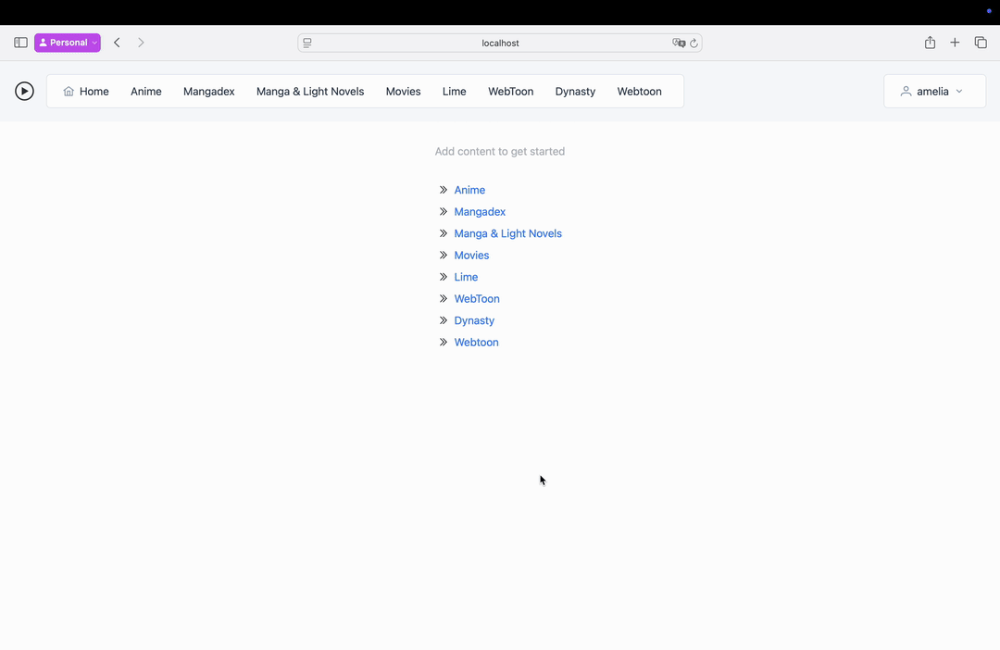

# Media-Provider

A web application for downloading content. Written in Go, and Angular. With a simple to navigate interface.
Set up once, no need to touch files again. 




Torrenting content with copy right is theft, bla bla, this is all educational, bla bla...

## Support

The project currently supports the following providers (websites), to fetch content from.
Read their respective Readme's for more information on which modifiers they support.

- [Lime torrents](limetorrents/Readme.MD)
- [Nyaa](nyaaReadme.MD)
- [YTS](yts/Readme.MD)
- [SubsPlease](subsplease/Readme.MD)
- [Mangadex](mangadex/Readme.MD)

## Config

Configuring the web can be done completely through the UI. No need to touch files.

<details open>
<summary>Screenshot</summary>


</details>

However, adding lots of modifiers at once may be painful through the UI. You can edit the `config.json` file by hand if needed.
It is recommended to turn off the web server while editing the file, it shouldn't cause issues. But it's better to be safe than sorry.

When using the docker image, the config will be stored in `/mp`, together with the default download directory `/mp/temp`.
The config dir and file can be changed by setting the `CONFIG_DIR` and `CONFIG_FILE` environment variables.

### Modifiers

Modifiers depend on the provider used for your page, see the provider's Readme for more information.
You can set up modifiers, so sort, filter, ... your search queries. The title and value are free to choose.
While the key, and value key must match with the ones provided in the ReadME's.

The default config comes with some modifiers for each provider, use them as an example.

## Docker compose

Is it recommended to use the docker image, no other way is officially supported.
The image is available on [Docker Hub](https://hub.docker.com/r/ameliaah/media-provider). 
Here is a simple example;

```yaml
media-provider:
  image: ameliaah/media-provider:latest
  restart: "on-failure:3"
  ports:
    - "8080:8080"
  volumes:
    - ./mp-data:/mp
```

Or with docker run, 

`docker run -v ./mp-data:/mp -p 8080:8080 ameliaah/media-provider:latest`
