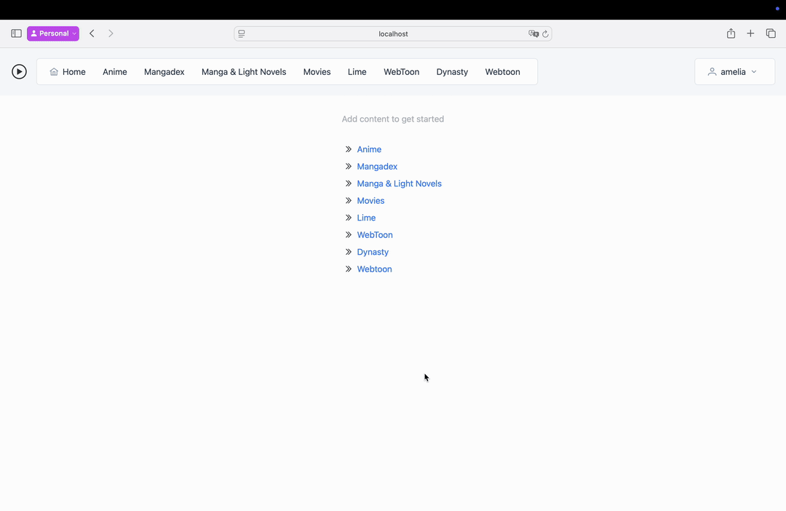

# Media Provider

A web application for downloading content. Written in Go, and Angular. With a simple to navigate interface.
Set up once, no need to touch files again. 

The video is slightly outdated

Torrenting content with copy right is theft, bla bla, this is all educational, bla bla...
